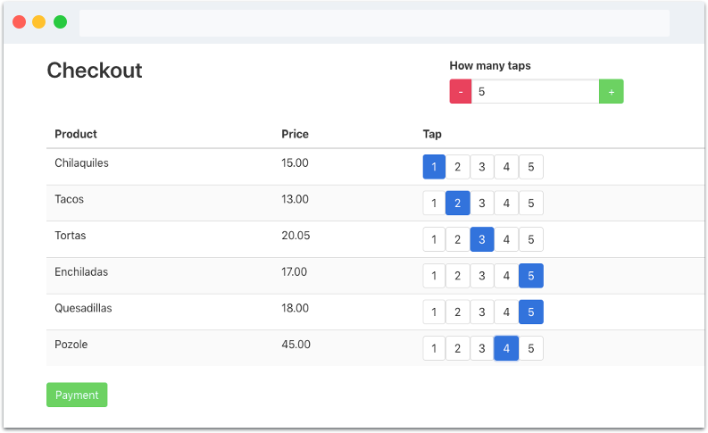

# EasyPay

EasyPay is a revolutionary way to make payments faster and easier.

---

To use this product.

Clone the repo.

`git clone https://github.com/gustavvopenna/easypay`

Install the dependencies

`npm install`

Configure the environment variables using your text editor of choice (use the .env.example)

`code .env`

Start the server

`npm start`
